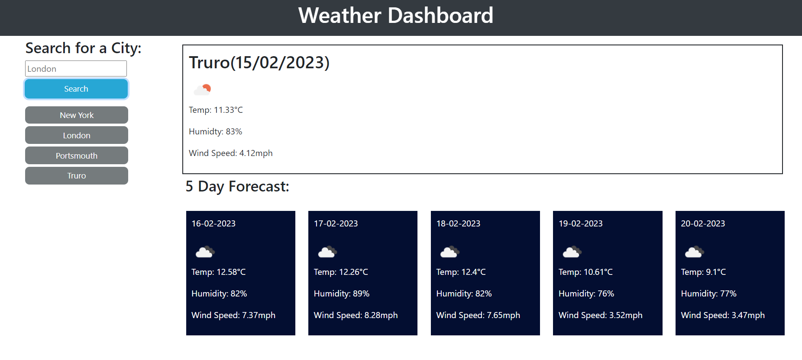

# Server-APIs-Weather-Dashboard

Server APIs allow developers to access their data and functionality by making requests with specific parameters to a URL. Developers are often tasked with retrieving data from another application's API and using it in the context of their own. Your Challenge is to build a weather dashboard that will run in the browser and feature dynamically updated HTML and CSS.

## User Story

- **AS** a traveler
- **I WANT** to see the weather outlook for multiple cities
- **SO THAT** I can plan a trip accordingly

## Acceptance Criteria

- **WHEN** viewing weather dashboard
- **THEN** the user is presented with form inputs
- **WHEN** a user searches for a city
- **THEN** they are presented with current and future conditions for that city; the city is added to local storage and a button is dynamically created.
- **WHEN** a user views the current weather conditions for that city 
- **THEN** they are presented with: the city name; the date; an icon representation of weather conditions; the temperature; the humidity; the wind speed
- **WHEN** a user views future weather conditions for that city
- **THEN** they are presented with a 5-day forecast that displays:the date; an icon representation of weather conditions; the temperature; the humidity; the wind speed
- **WHEN**  a user clicks on dynamically created button
- **THEN** they are again presented with current and future conditions for that city.

## Usage
- Deployed Site: 

## Credits
The following websites were used to support this project:
- https://www.mulesoft.com/resources/api/what-is-an-api
- https://developer.mozilla.org/en-US/docs/Web/Accessibility/ARIA/Roles/region_role
- https://api.jquery.com/val/
- https://developer.mozilla.org/en-US/docs/Web/JavaScript/Reference/Global_Objects/String/trim
- https://developer.mozilla.org/en-US/docs/Web/API/Event/preventDefault

## License

Permission is hereby granted, free of charge, to any person obtaining a copy of this software and associated documentation files (the "Software"), to deal in the Software without restriction, including without limitation the rights to use, copy, modify, merge, publish, distribute, sublicense, and/or sell copies of the Software, and to permit persons to whom the Software is furnished to do so, subject to the following conditions:

